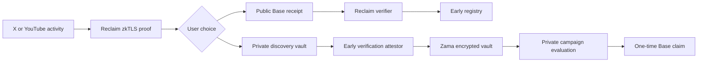

# Early

[](LICENSE)
[](https://sepolia.basescan.org)
[](https://docs.zama.ai/fhevm)

**Being early used to be a story. Now it is proof.**

Early is a verified discovery protocol. It lets people prove they found and
supported a post, creator, video, or idea before the crowd arrived, then choose
whether that proof becomes a public receipt or a private campaign signal.

X is the first production provider. YouTube is the second V2 provider target.
The protocol is designed to support more cultural platforms through versioned
Reclaim provider schemas.

## V2 Architecture



### Public receipt

`EarlyDiscoveryRegistry.verifyAndRegister` verifies a Reclaim proof and creates
the receipt in the same Base transaction. There is no separate publish method.
The contract checks:

- the Reclaim claim owner and signed context match `msg.sender`;
- the provider configuration hash and schema version are allowlisted;
- an X proof contains a like, a reply, and the reply-to relationship;
- a YouTube proof contains the required comment and video relationship;
- proof identifiers, session nullifiers, and commitments have not been used.

The registry stores only the wallet owner, proof ID, platform hash, subject
hash, content hash, provider hash, and verification time.

### Private vault

`EarlyPrivateDiscoveryVault` stores encrypted earliest-discovery time and
qualifying interaction count. A freely supplied encrypted delta is never
accepted.

The Early attestor verifies the Reclaim proof, derives the exact input, encrypts
it for the Zama contract, and signs an EIP-712 attestation binding the
ciphertext, opaque vault, proof commitment, subject, nonce, expiry, chain, and
contract. The contract rejects changed ciphertext, reused commitments, and
consumed nonces.

Campaign rules are public in V2. Only the final eligibility boolean is
decrypted. An independently scoped bridge signer then produces an expiring,
one-time Base authorization consumed by `CampaignClaims`.

## Privacy Boundary

Early exposes two deliberately different paths:

| Path | Public information | Trusted party |
| --- | --- | --- |
| Base receipt | Selected Reclaim proof fields appear in transaction calldata | Reclaim verifier and Base contracts |
| Zama vault | Opaque artifact hashes and final eligibility | Early attestor sees verified plaintext before encryption |

FHE protects accumulated discovery history and campaign computation. It does
not hide data a user deliberately publishes through the public receipt path.
Replacing the V2 attestor with a proof that directly binds Reclaim output to FHE
ciphertext is a future trustless milestone.

## Repository

```text
src/
  app/api/                 Authenticated proof, receipt, vault, and campaign APIs
  app/proof/               Reclaim proof console
  app/vault/               Opaque private artifact vault
  app/campaigns/           Creator and brand campaign workspace
  app/developers/          Schemas, trust boundaries, and integration examples
  lib/proof-model.ts       Normalized V2 proof types and commitments
contracts/
  base/                    Foundry registry and campaign claim contracts
  zama-private-receipt/    FHEVM private discovery vault
fixtures/providers/        Versioned X and YouTube claim fixtures
supabase/                  Normalized V2 database migration
archive/stellar-v1/        Preserved, inactive Stellar V1 implementation
```

Stellar V1 is historical reference only. It is excluded from active
compilation, application routes, dependencies, and environment configuration.

## Contracts

### Base Sepolia

Reclaim verifier:

```text
0xF90085f5Fd1a3bEb8678623409b3811eCeC5f6A5
```

Base mainnet Reclaim verifier, for future mainnet deployment:

```text
0x8CDc031d5B7F148ab0435028B16c682c469CEfC3
```

Deployment output is recorded in
`contracts/base/deployments/base-sepolia.json`. Registry and campaign contract
addresses remain `null` until a deployment succeeds.

### Zama Ethereum Sepolia

Zama V2 remains on Ethereum Sepolia because the current FHEVM host and gateway
configuration target Sepolia. Deployment output is recorded in
`contracts/zama-private-receipt/deployments/sepolia.json`.

## Local Setup

Requirements:

- Node.js 22 or newer
- pnpm 9
- Foundry for Base contracts

Install and configure:

```bash
pnpm install
cp .env.example .env.local
```

Apply `supabase/v2_verified_discovery.sql` to a Supabase project. V1 tables are
not altered.

Start the app:

```bash
pnpm dev
```

Run the checks:

```bash
pnpm lint
pnpm typecheck
pnpm test:app
pnpm build
pnpm test:base
pnpm test:zama
```

## Environment

See `.env.example` for the complete list. The important groups are:

- Reclaim application and versioned X/YouTube provider configuration;
- Privy server verification and browser app ID;
- strict application origins and encrypted raw-proof retention;
- Base RPC, registry, and campaign claim contracts;
- Zama vault, relayer, and RPC;
- separate KMS-backed attestor and bridge services.

Never expose the Reclaim secret, Supabase service role, encryption key, service
tokens, or KMS credentials to the browser.

Raw proofs are encrypted at rest and removed after receipt or vault
finalization, or by the retention job within 24 hours.

## Deploy Base

Build the Foundry workspace, then run the deployment script:

```bash
pnpm build:base
BASE_RPC_URL=... \
BASE_DEPLOYER_PRIVATE_KEY=... \
EARLY_BRIDGE_SIGNER_ADDRESS=... \
pnpm deploy:base
```

Optional provider hashes can be configured during deployment with:

```text
RECLAIM_X_PROVIDER_CONFIGURATION_HASH
RECLAIM_YOUTUBE_PROVIDER_CONFIGURATION_HASH
```

After deployment, publish and verify all first-party source on Basescan, then
copy the deployed addresses into `.env.local`.

## Deploy Zama

```bash
pnpm --dir contracts/zama-private-receipt install
EARLY_ATTESTOR_ADDRESS=... \
EARLY_RELAYER_ADDRESS=... \
pnpm --dir contracts/zama-private-receipt run deploy:sepolia
```

Production attestation and bridge keys must live in a managed KMS under
different roles. Raw private-key fallbacks are intentionally not implemented in
the Next.js application.

## Provider Requirements

The X V2 provider must prove:

- focal post ID;
- authenticated account;
- liked state;
- reply ID;
- reply-to relationship;
- reply timestamp.

The YouTube V2 provider must prove:

- focal video ID;
- authenticated account;
- comment ID;
- comment-to-video relationship;
- publication time;
- required engagement state.

Provider changes require a new version and configuration hash. Fixtures in
`fixtures/providers` document the signed claim shape expected by application
and contract tests.

## Security Invariants

- A direct receipt call without a valid Reclaim proof reverts.
- Receipt creation cannot bypass the verifier.
- The caller wallet must match the Reclaim context and claim owner.
- Duplicate proofs, sessions, commitments, nonces, and claim nullifiers revert.
- Changed encrypted input is rejected by the Zama attestation.
- Callback processing is authenticated, idempotent, and origin restricted.
- Base and Zama transaction events are reconciled before database confirmation.
- Public and private paths disclose their different privacy properties before
  the user acts.

## Current Deployment Status

The contracts, APIs, database migration, and product surfaces are implemented
for testnet deployment. A real X end-to-end run requires project-specific
Reclaim, Privy, Supabase, Base, Zama, attestor, and bridge environment values.
The repository does not publish placeholder transaction links as live proof.

## License

Early first-party source is licensed under the
[Apache License 2.0](LICENSE). Dependency licenses remain unchanged.
